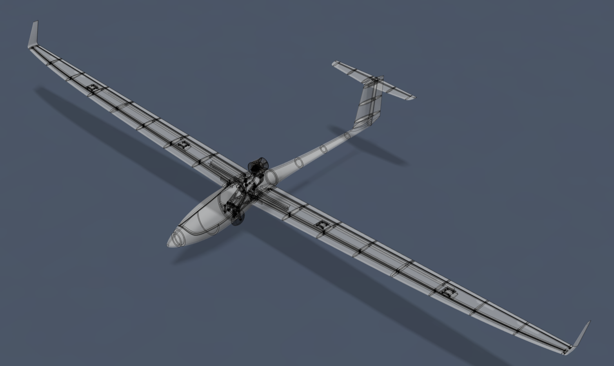

# ✈️ Planeur ASG 29

Réalisation d'un modèle réduit télécommande du planeur ASG 29 à l'échelle 1:4 imprimé en 3D

## ⚙️ Caractéristiques

| Catégorie | Caractéristique | Valeur |
| :--- | :--- | :--- |
| **Dimensions** | 📐 Envergure | `3750 mm` |
| | 📏 Longueur | `--- mm` |
| | 🪽 Surface alaire | `--- dm²` |
| **Aérodynamique**| 📉 Profil d'aile | `HQ 3.0/12` `HQ 3.0/14` |
| | ⚖️ Allongement | `---` |
| | 📐 Vé longitudinal | `1.5°` |
| **Masse & Charge**| ⚖️ Masse en vol | `4500 g` |
| | 🏋️ Charge alaire | `--- g/dm²` |
| | 📍 Centrage (CG) | `--- mm` |
| **Eléctronique** | 🔋 Alimentation | LiPo 5S `--- mAh` |
| | 🎮 Fonctions RC | `Aileron` `Volet` `Profondeur` `Direction` `Train rentrant` `Turbine escamotable`|
| | 🛠️ Servos | `6x` `KST X10 mini` `6x` `KST CM653`|

## 📋 Nomenclature
[Nomenclature](BOM.md)

