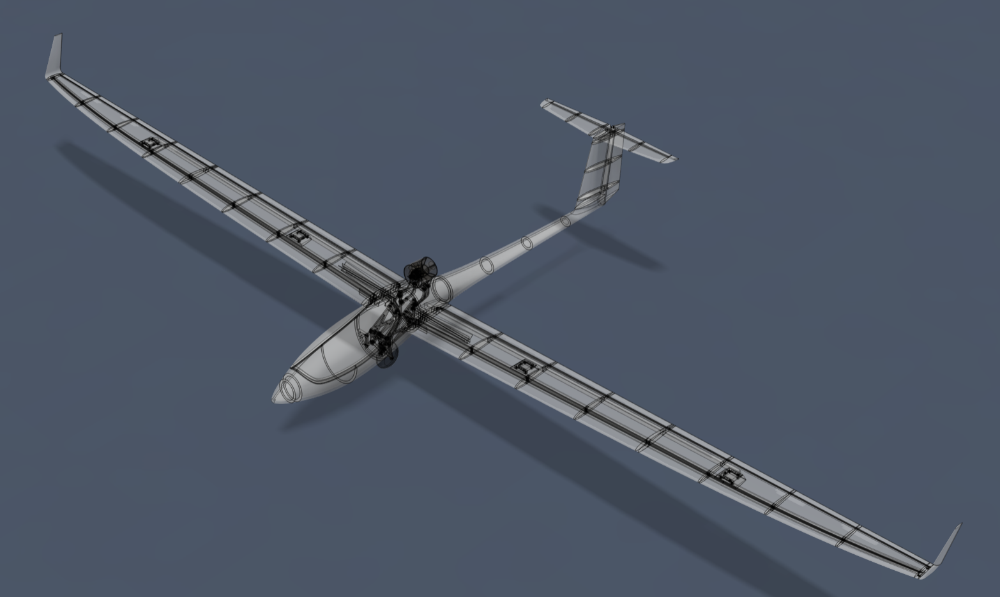

# ✈️ Planeur ASG 29

Réalisation d'un modèle réduit du planeur [ASG 29](https://www.alexander-schleicher.de/en/flugzeuge/asg-29/) d'[Alexandre Schleicher ](https://www.alexander-schleicher.de/en/)

# ⚙️ Caractéristiques
| Catégorie | Caractéristique | Valeur |
| :--- | :--- | :--- |
| **Dimensions** | Envergure | `3750 mm` |
| | Longueur | `--- mm` |
| | Surface alaire | `--- dm²` |
| **Aérodynamique**| Profil d'aile | `HQ 3.0/12` `HQ 3.0/14` |
| | Allongement | `---` |
| | Vé longitudinal | `1.5°` |
| **Masse & Charge**| Masse en vol | `4500 g` |
| | Charge alaire | `--- g/dm²` |
| | Centrage (CG) | `--- mm` |

# 🛠️ Composants

## Impression 3D

La [Nomenclature](bom.md) présente chaque pièce à imprimer au format `STL` avec les paramètres d'impression importants à respecter.

## Mécanique

## Eléctronique

| Catégorie | Caractéristique | Valeur |
| :--- | :--- | :--- |
| **Eléctronique** | Alimentation | `LiPo` `5S` `--- mAh` |
| | Fonctions RC | `Aileron` `Volet` `Profondeur` `Direction` `Train rentrant` `Turbine escamotable`|
